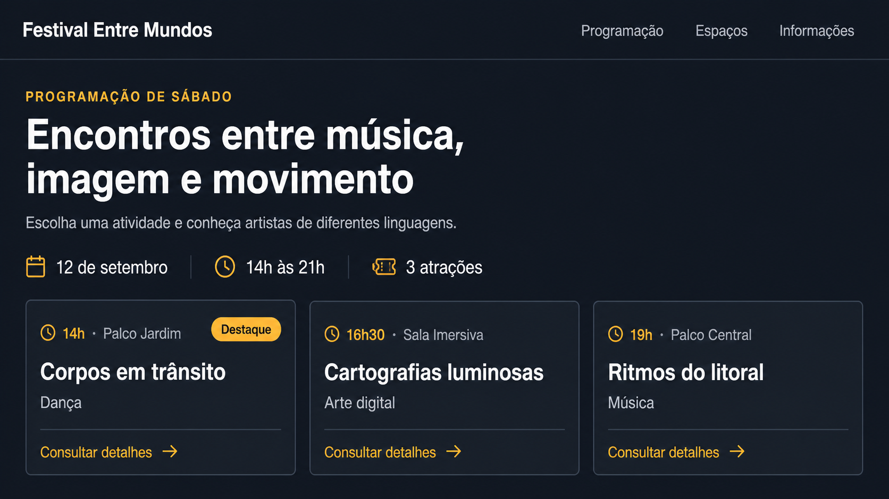

# Encontro 5 — Oficina prática de revisão do Tailwind CSS

**Unidade:** Unidade 1
**Carga horária:** 1,5h
**Entrega prevista:** painel de programação de um festival construído do zero

## Visão geral

Nos encontros anteriores, você configurou o Tailwind CSS, aplicou utilitários visuais e organizou uma página com Flexbox e Grid. Neste encontro, esses conhecimentos serão retomados em uma atividade prática integradora, sem continuar o catálogo de cursos e sem fornecer uma interface pronta para copiar.

O novo problema é construir o **painel de programação de um festival cultural**. O projeto começará em uma pasta vazia, terá configuração própria com Docker e utilizará outro conteúdo, outra estrutura e outra composição visual. Cada etapa apresenta um requisito antes de sugerir classes. Você deverá escolher a solução, observar o resultado e registrar a justificativa.

## Objetivos de aprendizagem

- preparar do zero um projeto Tailwind executado com Docker Compose;
- explicar o caminho entre HTML, CSS de entrada, CLI e CSS gerado;
- escolher utilitários a partir de requisitos visuais;
- aplicar cores, tipografia, espaçamento, dimensões, bordas e sombras;
- organizar relações unidimensionais com Flexbox;
- organizar uma coleção em linhas e colunas com Grid;
- controlar intervalos com `gap`;
- diferenciar alinhamento, distribuição e posicionamento;
- preservar semântica, foco visível e ordem de leitura;
- inspecionar o CSS gerado e corrigir problemas sem consultar uma solução completa.

## Conceitos revisados

| Encontro | Conhecimentos retomados |
|---|---|
| 2 | utility-first, instalação, CSS de entrada, compilação e artefato gerado |
| 3 | cores, tipografia, espaçamento, dimensões, bordas, raios e sombras |
| 4 | fluxo normal, Flexbox, Grid, `gap`, alinhamento e posicionamento |

## 1. Situação-problema

### Exemplo de resultado esperado



Use a imagem como referência para compreender a hierarquia, os agrupamentos e o nível de acabamento esperado. Ela não representa uma solução única: cores, medidas e pequenos detalhes podem variar, desde que a implementação atenda aos requisitos, preserve a semântica e utilize conscientemente os conceitos revisados.

Um festival cultural precisa publicar a programação de um turno. A interface deverá apresentar:

- identificação do evento;
- navegação para programação, espaços e informações;
- título e descrição da programação;
- resumo com data, horário e quantidade de atividades;
- três atividades, cada uma com horário, local, categoria e descrição;
- uma ação para consultar detalhes;
- um selo “Destaque” sobre uma das atividades.

O resultado não deve reproduzir a página de cursos dos encontros anteriores. Antes de escrever classes, desenhe rapidamente as regiões e responda:

1. qual é o assunto principal da página?
2. quais conteúdos formam conjuntos?
3. quais relações são unidimensionais?
4. qual coleção precisa compartilhar colunas?
5. onde existe sobreposição intencional?

## 2. Criar um projeto novo

Não continue na pasta `encontro-02-tailwind`. Crie um diretório independente:

```bash
mkdir encontro-05-revisao
cd encontro-05-revisao
mkdir src
touch src/index.html src/input.css
```

O projeto deverá chegar a esta estrutura:

```text
encontro-05-revisao/
├── .dockerignore
├── compose.yaml
├── Dockerfile
├── package.json
├── package-lock.json
└── src/
    ├── index.html
    ├── input.css
    └── output.css
```

### Inicializar o npm pelo contêiner

Use um contêiner temporário para criar `package.json`:

```bash
docker run --rm --user "$(id -u):$(id -g)" \
  --volume "$PWD:/app" \
  --workdir /app \
  node:22-alpine npm init -y
```

Instale Tailwind CSS e sua CLI:

```bash
docker run --rm --user "$(id -u):$(id -g)" \
  --volume "$PWD:/app" \
  --workdir /app \
  node:22-alpine npm install -D tailwindcss @tailwindcss/cli
```

Em `src/input.css`, importe o framework:

```css
@import "tailwindcss";
```

No `package.json`, configure:

```json
{
  "scripts": {
    "dev": "tailwindcss -i ./src/input.css -o ./src/output.css --watch",
    "build": "tailwindcss -i ./src/input.css -o ./src/output.css --minify"
  }
}
```

### Preparar Docker e Compose

Crie o `Dockerfile`:

```dockerfile
FROM node:22-alpine

WORKDIR /app

COPY package*.json ./
RUN npm ci

COPY . .

CMD ["npm", "run", "dev"]
```

Crie `.dockerignore`:

```text
node_modules
src/output.css
.git
```

Crie `compose.yaml`:

```yaml
services:
  tailwind:
    build: .
    volumes:
      - .:/app
      - /app/node_modules
```

Construa a imagem e inicie a observação:

```bash
docker compose up --build
```

Mantenha o terminal ativo. Nas próximas execuções, enquanto as dependências não mudarem, use `docker compose up`.

## 3. Construir primeiro o HTML sem classes

Crie o documento completo antes da apresentação:

```html
<!doctype html>
<html lang="pt-BR">
  <head>
    <meta charset="UTF-8" />
    <meta name="viewport" content="width=device-width, initial-scale=1.0" />
    <title>Festival Entre Mundos</title>
    <link rel="stylesheet" href="./output.css" />
  </head>
  <body>
    <header>
      <a href="#inicio">Festival Entre Mundos</a>
      <nav aria-label="Navegação principal">
        <a href="#programacao" aria-current="page">Programação</a>
        <a href="#espacos">Espaços</a>
        <a href="#informacoes">Informações</a>
      </nav>
    </header>

    <main id="inicio">
      <section aria-labelledby="titulo-programacao">
        <p>Programação de sábado</p>
        <h1 id="titulo-programacao">Encontros entre música, imagem e movimento</h1>
        <p>Escolha uma atividade e conheça artistas de diferentes linguagens.</p>

        <dl>
          <div><dt>Data</dt><dd>12 de setembro</dd></div>
          <div><dt>Horário</dt><dd>14h às 21h</dd></div>
          <div><dt>Atividades</dt><dd>3 atrações</dd></div>
        </dl>

        <div id="programacao">
          <article>
            <p><time datetime="2026-09-12T14:00">14h</time> · Palco Jardim</p>
            <h2>Corpos em trânsito</h2>
            <p>Dança</p>
            <p>Performance que investiga deslocamento, memória e território.</p>
            <a href="#corpos-em-transito">Consultar detalhes</a>
          </article>

          <article>
            <p><time datetime="2026-09-12T16:30">16h30</time> · Sala Imersiva</p>
            <h2>Cartografias luminosas</h2>
            <p>Arte digital</p>
            <p>Instalação audiovisual criada a partir de dados da cidade.</p>
            <a href="#cartografias-luminosas">Consultar detalhes</a>
          </article>

          <article>
            <p><time datetime="2026-09-12T19:00">19h</time> · Palco Central</p>
            <h2>Ritmos do litoral</h2>
            <p>Música</p>
            <p>Concerto que aproxima instrumentos tradicionais e música eletrônica.</p>
            <a href="#ritmos-do-litoral">Consultar detalhes</a>
          </article>
        </div>
      </section>
    </main>
  </body>
</html>
```


## 4. Rodada 1 — Fundamentos visuais

Nesta rodada, não use Flexbox, Grid nem posicionamento. Trabalhe somente com os utilitários do Encontro 3.

### Requisito A — Base da página

A página precisa de fundo neutro, texto legível, altura mínima e conteúdo centralizado com largura limitada.

Escolha classes das famílias:

```text
min-h-*  bg-*  text-*  mx-auto  max-w-*  p-*  px-*  py-*
```

Um ponto de partida possível para o `body` é:

```html
<body class="min-h-screen bg-slate-950 text-slate-100">
```

Não copie uma combinação completa. Decida no `main` qual largura máxima e qual preenchimento atendem ao conteúdo.

### Requisito B — Hierarquia da introdução

A categoria deve ter menor tamanho e cor de destaque; o título deve dominar a seção; a descrição precisa ter altura de linha confortável e largura de leitura controlada.

Utilitários a revisar:

- `text-sm`, `text-4xl` e `font-bold`;
- `leading-7` e `max-w-prose`;
- `mt-2`, `mt-4` e cores de texto.

Exemplo apenas para a categoria:

```html
<p class="text-sm font-semibold uppercase tracking-wider text-amber-400">
  Programação de sábado
</p>
```

Explique o efeito de cada classe antes de estilizar o `h1`.

### Requisito C — Superfícies das atividades

Cada atividade precisa ser percebida como uma superfície independente.

```html
<article class="rounded-xl border border-slate-800 bg-slate-900 p-6 shadow-lg">
  <!-- preserve todo o conteúdo semântico -->
</article>
```

Investigue:

1. qual classe cria espaço interno?
2. qual classe define a espessura e qual define a cor da borda?
3. a sombra é necessária sobre esse fundo?
4. o conteúdo cresce sem ser cortado?


## 5. Rodada 2 — Flexbox e alinhamento

Use Flexbox somente quando a relação principal ocorrer em um eixo.

### Requisito A — Cabeçalho

O nome do festival e a navegação devem ocupar o mesmo eixo, com intervalo mínimo. Aplique as classes progressivamente:

1. adicione `flex` e observe os filhos diretos;
2. adicione `items-center` e identifique o eixo transversal;
3. adicione `justify-between` e observe o espaço livre;
4. adicione `gap-6` para garantir distância mínima;
5. transforme o `nav` em outro Flexbox com `flex gap-5`.

```html
<header class="flex items-center justify-between gap-6">
  <a href="#inicio">Festival Entre Mundos</a>
  <nav class="flex gap-5" aria-label="Navegação principal">...</nav>
</header>
```

Estilize textos e foco somente depois de confirmar o layout.

### Requisito B — Resumo

Os três grupos do `dl` devem formar uma sequência horizontal. O `dl` é o contêiner e cada `div` é um item.

```html
<dl class="flex gap-8">
  <div>
    <dt class="text-sm text-slate-400">Data</dt>
    <dd class="mt-1 font-semibold text-white">12 de setembro</dd>
  </div>
  <!-- demais dados -->
</dl>
```

Não use `justify-between` automaticamente. Compare `gap-8` com a distribuição do espaço livre e escolha a relação visual mais apropriada.

## 6. Rodada 3 — Grid e gap

O contêiner `#programacao` reúne uma coleção. Aplique uma classe por vez:

```html
<!-- Passo 1: estabelece o sistema -->
<div id="programacao" class="grid">

<!-- Passo 2: cria três trilhas equivalentes -->
<div id="programacao" class="grid grid-cols-3">

<!-- Passo 3: cria intervalo entre as células -->
<div id="programacao" class="grid grid-cols-3 gap-6">
```

Após cada passo:

- inspecione a sobreposição de Grid no DevTools;
- conte as trilhas;
- confirme quais elementos são itens;
- verifique que `gap` não cria espaço nas bordas externas;
- aumente uma descrição e observe a altura da linha.

### Alinhar ações de conteúdos diferentes

Transforme cada `article` em Flexbox vertical:

```html
<article class="flex h-full flex-col rounded-xl border border-slate-800 bg-slate-900 p-6">
  <!-- horário, título, categoria e descrição -->
  <a class="mt-auto pt-6" href="#atividade">Consultar detalhes</a>
</article>
```

- `flex-col` muda o eixo principal para vertical;
- `h-full` permite acompanhar a altura da célula;
- `mt-auto` absorve o espaço antes da ação;
- `pt-6` preserva um intervalo mínimo.

## 7. Rodada 4 — Posicionamento com propósito

Somente uma atividade deve receber o selo “Destaque”. Acrescente o selo ao primeiro cartão:

```html
<article class="relative ...">
  <span class="absolute right-4 top-4 rounded-full bg-amber-400 px-3 py-1 text-xs font-bold text-slate-950">
    Destaque
  </span>
  <!-- conteúdo existente -->
</article>
```

Teste primeiro sem `relative` e descubra qual elemento funciona como referência. Depois restaure a classe. Confirme que o selo não cobre horário, título ou foco. Se cobrir, ajuste o espaço interno ou a posição; não reduza o texto para esconder o problema.

## 8. Rodada 5 — Estados e acessibilidade já conhecidos

Todos os links precisam comunicar interação por mouse e teclado. Construa uma ação e replique a decisão:

```html
<a
  class="inline-flex rounded-md bg-amber-400 px-4 py-3 font-semibold text-slate-950 hover:bg-amber-300 focus-visible:outline-2 focus-visible:outline-offset-4 focus-visible:outline-amber-400"
  href="#corpos-em-transito"
>
  Consultar detalhes
</a>
```

Verifique:

- `hover:` não é o único feedback;
- `focus-visible:` aparece ao navegar com `Tab`;
- o contraste permanece legível;
- a ordem do foco acompanha o HTML;
- nenhuma `div` foi usada como botão ou link.

## 9. Entrega

Entregue a pasta do projeto com:

- arquivos de configuração e código-fonte;
- `src/index.html` concluído;
- README com instruções Docker;
- uma captura da versão sem classes;
- uma captura da versão final;
- respostas breves para os dois erros intencionais;
- lista de três decisões técnicas justificadas.

O README deve incluir:

```bash
docker compose up
docker compose up --build
docker compose down
```
